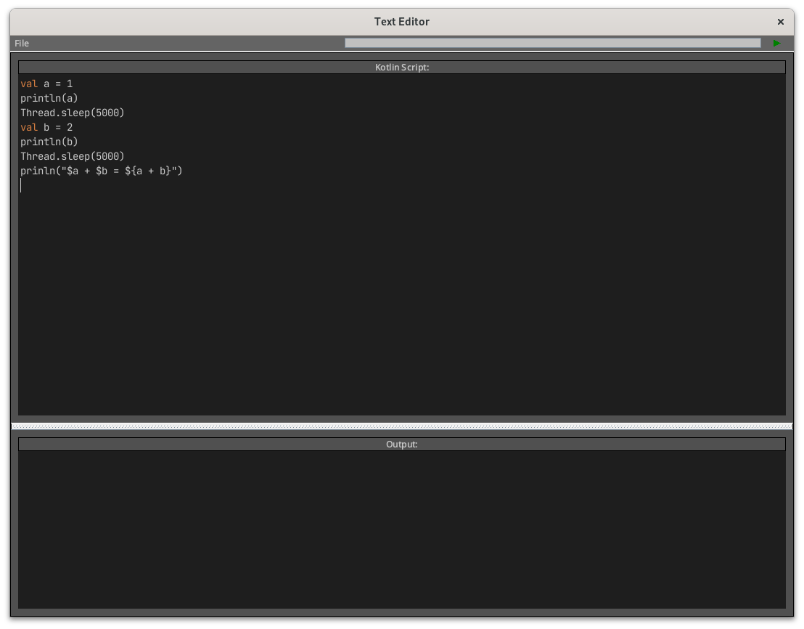
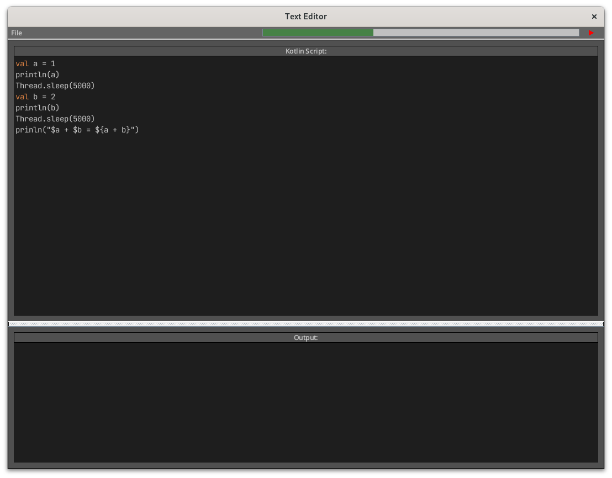
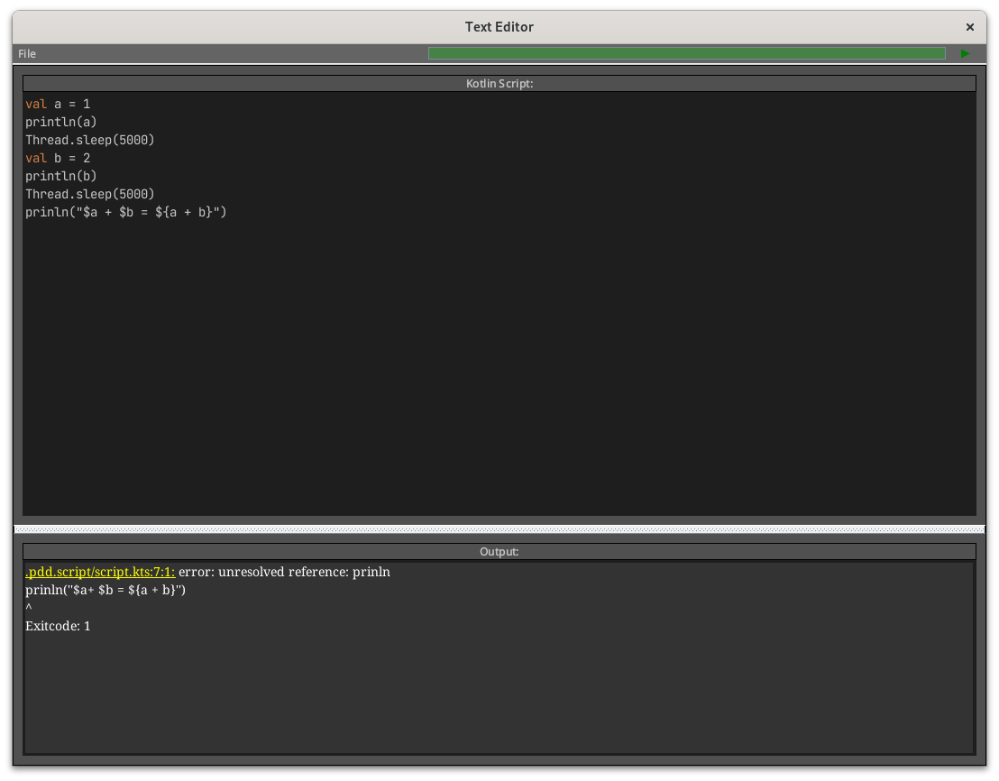
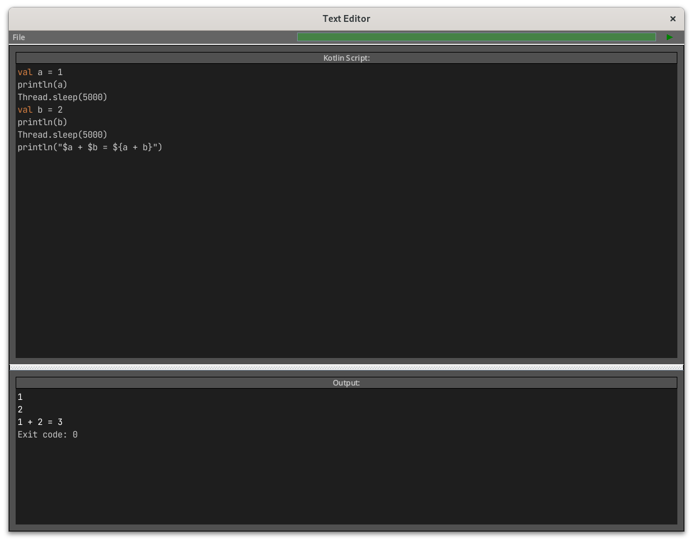

# Kotlin-Script-Editor

Simple GUI application for execution Kotlin-scripts, based on Swing

## Build

To build the project, you can use the following command:

```bash
./gradlew build
```

## Run

To run the project, you can use the following command:

```bash
./gradlew run
```

## Screenshots

### View of application


### Execution


### Error links
After clicking on hyperlink you're moving to place with error


### Finished execution

